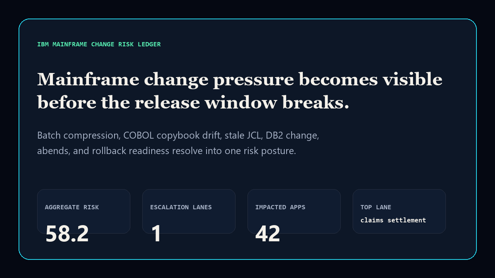
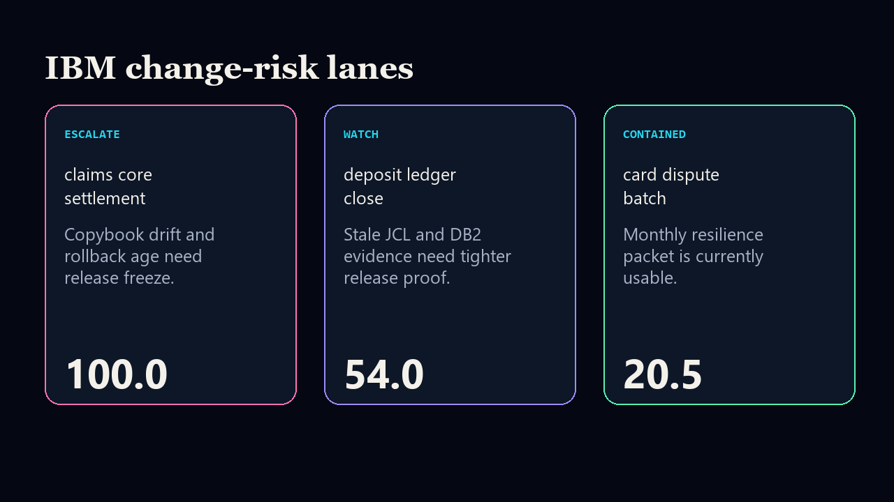

# ibm-mainframe-change-risk-ledger

[](https://github.com/mizcausevic-dev/ibm-mainframe-change-risk-ledger/actions/workflows/ci.yml)
[](https://github.com/mizcausevic-dev/ibm-mainframe-change-risk-ledger/actions/workflows/pages.yml)
[](LICENSE)

IBM mainframe change-risk ledger for batch-window pressure, COBOL copybook drift, stale JCL, DB2 change volume, abend exposure, and rollback readiness.

- Live: https://mizcausevic-dev.github.io/ibm-mainframe-change-risk-ledger/
- Repo: https://github.com/mizcausevic-dev/ibm-mainframe-change-risk-ledger




## Why this exists

Mainframe modernization risk is rarely only a code-modernization problem. It is release-window compression, COBOL copybook drift, stale JCL, DB2 migration volume, abend exposure, and rollback readiness. This repo makes that exposure readable for executives without pretending the mainframe disappears overnight.

## What it includes

- TypeScript scoring engine and CLI
- synthetic IBM z/OS change-risk fixture
- COBOL sample artifact
- JCL sample job
- SQL extraction contract
- static GitHub Pages surface
- README proof renders
- CI coverage, SQL/artifact checks, prerender smoke test

## Local run

```bash
npm install
npm run verify
npx ibm-mainframe-change-risk-ledger fixtures/mainframe-change-risk.json --format=json
```

## Board-readable output

- aggregate mainframe change-risk score
- escalation-lane count
- impacted application estimate
- posture per system lane: `escalate`, `watch`, or `contained`
- primary recommendation tied to the highest-risk system
